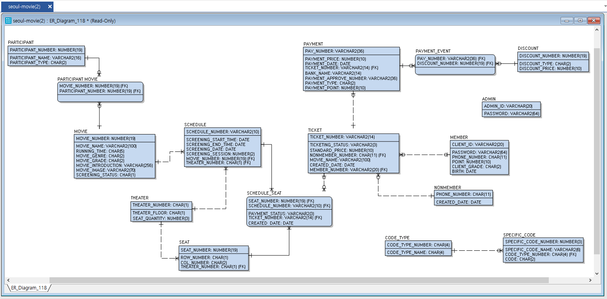
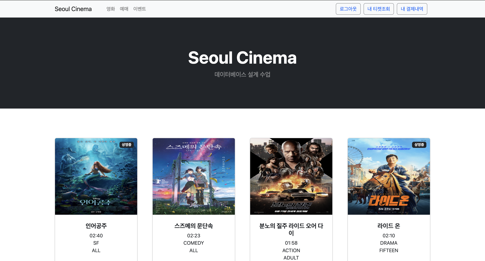
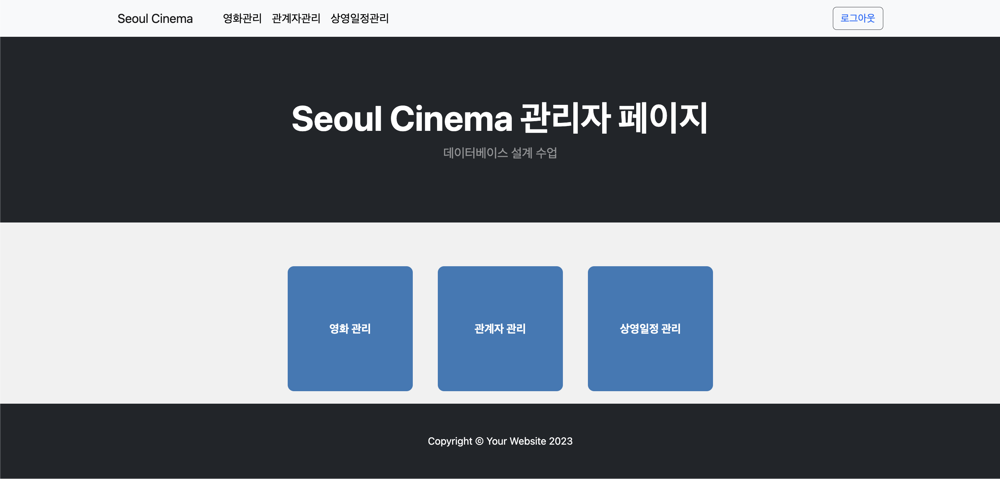
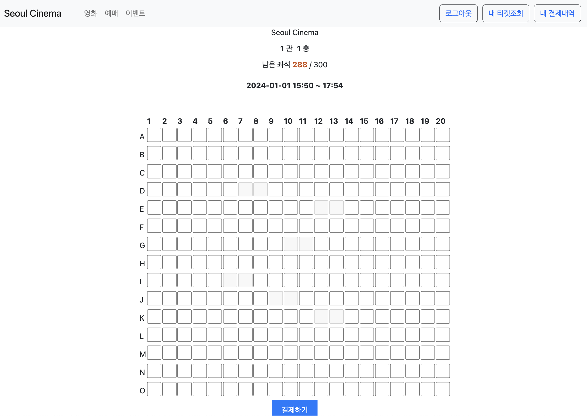

## 서울시립대학교 2023년도 1학기 데이터베이스 설계
- 진행 기간: 2023. 03. ~ 2023. 06.
- 개발 인원:
    - 백엔드: 3명

[프로젝트 회고 링크](https://velog.io/@sangmin1998/%EB%8D%B0%EC%9D%B4%ED%84%B0%EB%B2%A0%EC%9D%B4%EC%8A%A4-%EC%84%A4%EA%B3%84-%ED%94%84%EB%A1%9C%EC%A0%9D%ED%8A%B8-%ED%9A%8C%EA%B3%A0)
## 서울시네마 프로젝트 소개

### 배경
- 독자적인 예매 시스템을 구축하여 외부 서비스를 이용함으로써 드는 추가 비용 절약

## ERD

## 사용자 홈페이지 프로토타입

## 관리자 홈페이지 프로토타입

## 예매 진행

    - 이미 예매된 좌석은 클릭 불가

## 기능

### 사용자

#### 로그인 전
1. 영화를 전체 조회한다.

2. 영화의 상세정보를 확인한다.

3. 로그인을 안 한 상태에서 좌석을 예매하러 간다.
    - 로그인 페이지로 리다이렉트

4. 현재 받을 수 있는 할인들을 확인한다.

#### 회원가입 및 로그인 진행

1. 회원가입 및 로그인한다.
    - 비밀번호는 암호화되어 데이터베이스에 저장

##### 예매

1. 입력한 날짜의 상영 일정을 조회한다.
    - 영화를 지정 한 경우: 그 영화에 대한 상영 일정을 조회
    - 영화를 지정 하지 않은 경우: 모든 영화의 상영 일정을 조회
        

2. 특정 상영 일정을 선택하여 남아있는 좌석을 조회한다.
    - 이미 예약된 좌석 선택 불가능
    - 좌석 선택 후 결제 페이지로 넘어갈 시 5분 동안 좌석 확보

##### 결제
1. 결제 방법을 선택한다.

2. 결제 정보를 입력한다.
    - 카드 결제의 경우 카드 번호 입력 및 카드를 선택 (할인중)
    - 계좌 결제의 경우 계좌 번호 입력 및 은행을 선택
        
3. 최종 가격을 확인 후 결제를 진행한다.
    - 결제 금액의 10% 포인트 적립
        
4. 예매 내역(티켓)을 확인한다.
5. 티켓 번호를 눌러 예매 정보를 확인한다.
    - 영화, 시작시간, 종료시간, 상영관, 좌석번호 조회
        
6. 결제 내역을 확인한다.
7. 특정 결제 내역을 상세 조회한다.
    - 티켓 정보 + 가격 및 할인 받은 가격 조회
        
8. 결제 시나리오의 1-3 번을 반복하여 새로운 예매를 진행한다.
9. 새롭게 예매한 티켓을 상세보기하여 취소한다.
10. 결제가 취소된 것을 확인한다.
11. 내 티켓 내역에서 사라진 것을 확인한다.

비회원 시나리오
1.	예매를 위하여 휴대폰 번호를 입력한다.
2.	회원의 예매, 결제 시나리오와 동일하게 진행한다.
- 비회원은 티켓 조회만 가능하고 결제 내역 조회 불가능
---

### 관리자

1. 관리자 회원가입 및 로그인을 진행한다.
    - 로그인이 안돼있는 경우, 로그인 페이지로 리다이렉트된다.
        
2. 새로운 영화를 등록한다.
    - 사진 및 영화 정보 입력
    - 관계자(감독, 배우, 배급사) 등록
        

3. 영화를 수정한다.

4. 영화를 삭제한다.

5. 관계자(감독, 배우, 배급사)를 등록한다.
    - 이름 입력, 역할 등록
6. 관계자를 수정한다.
7. 관계자를 삭제한다.

8. 영화의 상영일정을 등록한다.
    - 영화, 상영관, 상영일자, 상영시작시간 등록, 상영회차 입력
        

9. 상영일정을 수정한다.

10. 상영일정을 삭제한다.

## 문서화
[최종보고서](./docs/디비설_최종발표보고서.docx)
- 개발환경, (엔티티타입, 관계, 용어사전, 도메인, 속성, 테이블, 인덱스) 정의서, ERD, CRUD Matrix